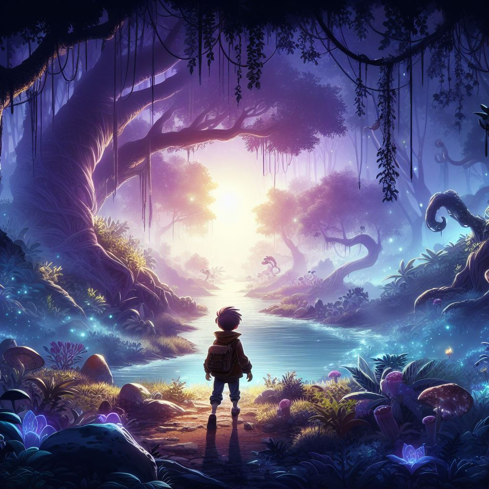

= Aura Scenario 
:experimental: 
:plantuml-server-url: http://www.plantuml.com/plantuml
:icons: font

.Cover du jeu

audio::Carrying_you.wav[]

//audio::Carrying_you.wav[start=60,opts=autoplay]

|===
|Shortcut |Purpose

|kbd:[F11]
|Toggle fullscreen

|kbd:[Ctrl+T]
|Open a new tab
|===

.Applications
[cols="1,1,2"] 
|===
|Name |Category |Description

|Firefox
|Browser
|Mozilla Firefox is an open source web browser.
It's designed for standards compliance,
performance, portability.

|Arquillian
|Testing
|An innovative and highly extensible testing platform.
Empowers developers to easily create real, automated tests.
|===

NOTE: An admonition draws the reader's attention to auxiliary information.

IMPORTANT: Don't forget the children!

TIP: Look for the warp zone under the bridge.

CAUTION: Slippery when wet.*

WARNING: The software you're about to use is untested.

.Optional Title
****
Sidebars are used to visually separate auxiliary bits of content
that supplement the main text.
****
